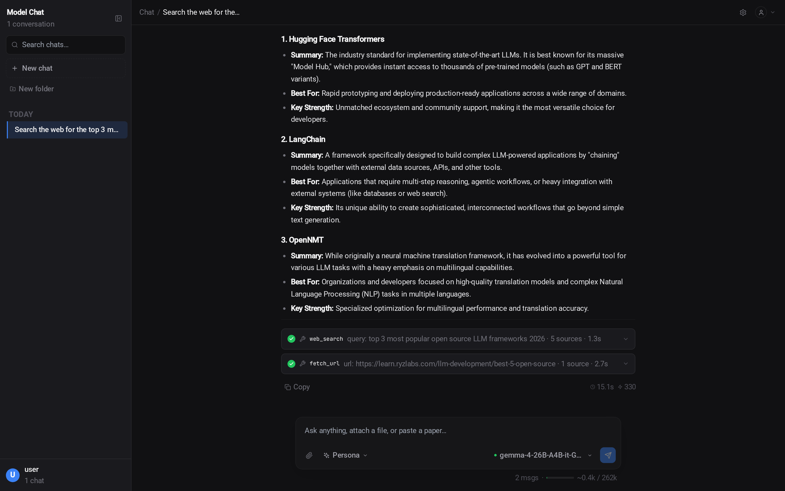

# Open Source Model Manager

> **A Production-Ready MLOps Platform for Large Language Models**

Containerized platform for serving and managing LLMs with dual backend support, web UI, chat interface, and an autonomous AI agent system.

<p align="center">
  <a href="https://www.docker.com/"></a>
  <a href="LICENSE"></a>
  <a href="https://developer.nvidia.com/cuda-toolkit"></a>
  <a href="https://nodejs.org/"></a>
  <a href="https://www.python.org/"></a>
</p>

---

## Features

### Dual Backend Support

| Backend | GPU Requirement | Best For |
|---------|-----------------|----------|
| **llama.cpp** | Maxwell 5.2+ (GTX 900, Quadro M4000) | GGUF models, older GPUs, CPU offload |
| **vLLM** | Pascal 6.0+ (GTX 1000+, Quadro P+) | High throughput, newer GPUs |

### Core Capabilities

- **HuggingFace Integration** — Search and download GGUF models directly
- **Auto-Configuration** — Optimal settings based on hardware detection
- **Real-time Monitoring** — WebSocket-based live logs, status, and download progress
- **Multi-User Support** — Authentication with session management and API keys
- **OpenAI-Compatible API** — Drop-in replacement for OpenAI endpoints
- **Vision Models** — Send images to vision-capable models (LLaVA, Qwen-VL) with OCR fallback for non-vision models
- **Thinking Models** — Parse and display reasoning from models like DeepSeek R1 and Qwen QwQ
- **Map-Reduce Chunking** — Automatically splits large content across multiple model calls and synthesizes results
- **Background Streaming** — Responses continue server-side if you navigate away, saved on completion
- **Auto-Continuation** — Automatically continues truncated responses up to 8 times

### Web Scraping & Search

- **[Scrapling](https://github.com/D4Vinci/Scrapling) Integration** — CAPTCHA-evading web scraping with StealthyFetcher
- **Multi-Engine Search** — DuckDuckGo → Scrapling → Brave Search → Playwright
- **Smart Content Extraction** — Playwright SPA/XHR interception, direct file download for PDFs/DOCX/XLSX

### Chat Interface

Lightweight React + Tailwind CSS chat UI at `https://localhost:3002`:

- 20 themes and 7 chat layouts (Default, Centered, Wide, Timeline, Terminal, Slack, Minimal)
- 54 font choices with dynamic Google Fonts loading
- Clipboard image paste and drag-and-drop file attachments
- Paste-as-file for large text (500+ chars auto-converted to attachment)
- Web search and URL fetch toggles with smart query extraction
- Email file parsing (.eml, .msg) with nested attachment extraction
- OCR text extraction for uploaded images via Tesseract

<p align="center">
  
</p>

### Koda — AI Agent TUI

Your autonomous AI project assistant running as an interactive terminal user interface:

```
  ██╗  ██╗ ██████╗ ██████╗  █████╗
  ██║ ██╔╝██╔═══██╗██╔══██╗██╔══██╗
  █████╔╝ ██║   ██║██║  ██║███████║
  ██╔═██╗ ██║   ██║██║  ██║██╔══██║
  ██║  ██╗╚██████╔╝██████╔╝██║  ██║
  ╚═╝  ╚═╝ ╚═════╝ ╚═════╝ ╚═╝  ╚═╝
  Your AI project assistant
```

- 77 built-in skills across 20 categories (file ops, git, web, email, OCR, PDF, system info, and more)
- Multi-agent collaboration for complex tasks
- Autonomous skill execution with false-completion detection
- AES-256 encrypted credentials
- Cross-platform (Linux, macOS, Windows)

---

## Prerequisites

**Required:** Docker 24.0+ with Compose v2, Linux (Ubuntu 20.04+), 4GB RAM minimum (8GB+ recommended)

**Optional:** NVIDIA GPU with Container Toolkit, HuggingFace token (for gated models)

---

## Quick Start

```bash
# Clone and build
git clone https://github.com/frontierstack/Open-Source-Model-Manager.git
cd Open-Source-Model-Manager

# Optional: set HuggingFace token
echo "HUGGING_FACE_HUB_TOKEN=hf_xxx" > .env

# Build and start (~20-25 min first time)
./build.sh && ./start.sh
```

| Interface | URL |
|-----------|-----|
| Web UI | https://localhost:3001 |
| Chat UI | https://localhost:3002 |

### Build Options

```bash
./build.sh                         # Parallel build (default)
./build.sh --no-parallel           # Sequential (low memory)
./build.sh --no-cache --no-resume  # Force full rebuild
```

---

## Usage

### Web Interface

1. Navigate to https://localhost:3001
2. Register account (first user = admin)
3. **Discover** — Search and download models
4. **My Models** — Launch and manage instances
5. **API Keys** — Generate access tokens
6. **Docs** — API code builder with 70+ endpoints in 4 languages

### Koda TUI

```bash
# Install and start
curl -sk https://localhost:3001/api/cli/install | bash
koda

# Authenticate and initialize
/auth    # Enter API key from Web UI
/init    # Analyze project structure

# Key commands
/help              # Show all commands
/mode agent        # Switch to agent mode
/web               # Toggle web search
/quit              # Exit
```

See [COMMANDS.md](COMMANDS.md) for complete command reference.

### API

OpenAI-compatible endpoints work with any OpenAI SDK client:

```bash
curl -sk https://localhost:3001/v1/chat/completions \
  -H "Authorization: Bearer YOUR_API_KEY" \
  -H "Content-Type: application/json" \
  -d '{"model": "model-name", "messages": [{"role": "user", "content": "Hello!"}]}'
```

```python
from openai import OpenAI
client = OpenAI(base_url="https://localhost:3001/v1", api_key="YOUR_API_KEY")
response = client.chat.completions.create(
    model="model-name",
    messages=[{"role": "user", "content": "Hello!"}]
)
```

---

## Configuration

### Environment Variables

```bash
HUGGING_FACE_HUB_TOKEN=hf_xxx         # For gated model downloads
HOST_IP=192.168.1.100                  # Container networking (auto-detected)
HOST_MODELS_PATH=/mnt/d/models         # Override models path (Windows+WSL)
NODE_TLS_REJECT_UNAUTHORIZED=0         # SSL bypass for corporate proxies
SESSION_SECRET=your-secret             # Auto-generated if not set
```

### Ports

| Service | Port | Purpose |
|---------|------|---------|
| Webapp | 3001 | HTTPS — Web UI & API |
| Chat | 3002 | HTTPS — Chat interface |
| Models | 8001+ | Dynamic model instances (localhost only) |

### Backend Settings

**llama.cpp** — Older GPUs, CPU offload
```
GPU Layers: -1 (all) | Context: 4096 | Cache: f16/q8_0/q4_0 | Parallel Slots: 1-8
```

**vLLM** — Newer GPUs, high throughput
```
Max Model Len: 4096 | GPU Memory: 0.9 | Tensor Parallel: 1 | Max Seqs: 256
```

---

## Architecture

```
┌─────────────────────────────────────────────────────────────────┐
│                          Client Layer                           │
│                                                                 │
│  Browser ─── HTTPS ──→ Web UI (:3001)                          │
│  Browser ─── HTTPS ──→ Chat UI (:3002)                         │
│  Terminal ── HTTPS ──→ Koda TUI (:3001/api)                    │
│                                                                 │
├─────────────────────────────────────────────────────────────────┤
│                       Application Layer                         │
│                                                                 │
│  ┌─────────────────────────────────────────────────────────┐   │
│  │              Webapp Container (:3001)                    │   │
│  │  React Frontend · Express API · WebSocket Server        │   │
│  │  Auth & Sessions · Agent & Skills (77 skills)           │   │
│  │  Docker Integration · OpenAI-Compatible Endpoints       │   │
│  │  Map-Reduce Chunking · Web Scraping (Scrapling)         │   │
│  └─────────────────────────────────────────────────────────┘   │
│  ┌─────────────────────────────────────────────────────────┐   │
│  │              Chat Container (:3002)                      │   │
│  │  React + Tailwind · 20 Themes · 7 Layouts               │   │
│  │  Vision & Thinking Models · File Attachments · OCR      │   │
│  └─────────────────────────────────────────────────────────┘   │
│                                                                 │
├─────────────────────────────────────────────────────────────────┤
│                    Container Orchestration                       │
│                                                                 │
│  Docker Engine ──┬── llamacpp-* (Maxwell 5.2+, GGUF)           │
│                  └── vllm-* (Pascal 6.0+, GGUF/HuggingFace)   │
│                                                                 │
│  NVIDIA GPU(s) · CUDA 12.1 · Shared VRAM                      │
└─────────────────────────────────────────────────────────────────┘
```

**Data Persistence:** All user data stored in `./models/.modelserver/` as JSON files (agents, skills, conversations, API keys with AES-256-GCM encryption). Model containers mount `./models` read-only.

---

## Troubleshooting

| Problem | Solution |
|---------|----------|
| Build fails / interrupted | `./build.sh` (auto-resumes) |
| Out of memory during build | `./build.sh --no-parallel` |
| Corrupted build state | `rm -rf .build-state/ && ./build.sh` |
| Model OOM errors | Reduce GPU layers, use q8_0/q4_0 cache type |
| Port 3001 in use | `netstat -tulpn \| grep 3001` to find conflict |
| GPU not detected | Reinstall NVIDIA Container Toolkit, test with `nvidia-smi` |
| Koda not found | `export PATH="$HOME/.local/bin:$PATH"` |
| SSL/corporate proxy errors | `echo "NODE_TLS_REJECT_UNAUTHORIZED=0" >> .env` |

```bash
# Common diagnostic commands
docker compose logs -f webapp       # View webapp logs
docker compose ps                   # Check service status
nvidia-smi                          # Check GPU
docker stats                        # Container resource usage
```

---

## Documentation

- **[COMMANDS.md](COMMANDS.md)** — Complete command and feature reference
- **[Docs Tab](https://localhost:3001)** — Interactive API code builder (70+ endpoints, 4 languages)

---

## Contributing

1. Fork the repository
2. Create feature branch (`git checkout -b feature/name`)
3. Commit and push changes
4. Open Pull Request

---

## License

MIT License — see [LICENSE](LICENSE).

## Acknowledgments

[llama.cpp](https://github.com/ggerganov/llama.cpp) | [vLLM](https://github.com/vllm-project/vllm) | [HuggingFace](https://huggingface.co/) | [Scrapling](https://github.com/D4Vinci/Scrapling) | [Playwright](https://playwright.dev/) | [Material-UI](https://mui.com/)

---

## Support

[GitHub Issues](https://github.com/frontierstack/Open-Source-Model-Manager/issues) | [GitHub Discussions](https://github.com/frontierstack/Open-Source-Model-Manager/discussions)

<div align="center">

**Built for the Open Source AI Community**

[Back to Top](#open-source-model-manager)

</div>
