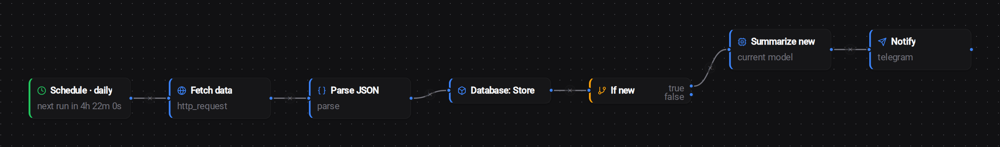

# Open Source Model Manager

> **A Production-Ready MLOps Platform for Large Language Models**

Containerized platform for serving and managing LLMs with dual backend support, web UI, chat interface, an autonomous AI agent system, and a [Pi (pi.dev)](https://pi.dev) terminal coding agent that talks to it over the OpenAI-compatible endpoint.

<p align="center">
  <a href="https://www.docker.com/"></a>
  <a href="LICENSE"></a>
  <a href="https://developer.nvidia.com/cuda-toolkit"></a>
  <a href="https://nodejs.org/"></a>
  <a href="https://www.python.org/"></a>
  <a href="https://pi.dev"></a>
</p>

---

## Features

### Dual Backend Support

| Backend | GPU Requirement | Best For |
|---------|-----------------|----------|
| **llama.cpp** | Maxwell 5.2+ (GTX 900, Quadro M4000) | GGUF models, older GPUs, CPU offload, single-stream chat, **Multi-Token Prediction (MTP) & draft-model speculative decoding** for 1.5–2× tok/s on DeepSeek-V3/R1, Qwen3-Next-MTP, and Qwen3.5/3.6-MTP variants |
| **sglang** | Turing 7.5+ (RTX 20-series, T4) — driver R570+ recommended | High-throughput concurrent serving, RadixAttention prefix caching, GGUF + safetensors + AWQ/GPTQ/FP8/NVFP4, native `--tool-call-parser` and `--reasoning-parser` for Qwen / DeepSeek / GLM / Kimi / Llama-3/4 / Mistral / GPT-OSS |

### Core Capabilities

- **HuggingFace Integration** — Search and download GGUF models directly
- **Auto-Configuration** — Optimal settings based on hardware detection
- **Real-time Monitoring** — WebSocket-based live logs, status, and download progress
- **Multi-User Support** — Authentication with session management and API keys
- **OpenAI-Compatible API** — Drop-in replacement for OpenAI endpoints
- **Vision Models** — Send images to vision-capable models (LLaVA, Qwen-VL) with OCR fallback for non-vision models
- **Thinking Models** — Parse and display reasoning from models like DeepSeek R1 and Qwen QwQ
- **Audio Transcription** — Built-in `transcribe_audio` skill (faster-whisper, bundled `small.en` model, CPU-only, runs in the sandbox)
- **Spreadsheets & SQL in chat** — `read_xlsx` (openpyxl) and `query_sqlite` skills let the model read XLSX files and run SELECTs (or DDL with `readonly=false`) against SQLite databases in the workspace
- **Document Generation** — `create_pdf` and `create_docx` skills render Markdown (including GFM tables) to PDF/DOCX, persisted to `/workspace/artifacts/`; a `contentFile` param accepts large input that would exceed the tool-arg token cap
- **Image Editing** — `transform_image` skill (Pillow) for resize, crop, thumbnail, rotate, format-convert, and grayscale operations
- **Auto-Download Chips** — Any file a sandboxed skill writes to `/workspace/artifacts/` is auto-promoted into a download chip in the chat (mtime-filtered so prior turns don't re-surface); `make_downloadable` promotes existing workspace files explicitly
- **Map-Reduce Chunking** — Automatically splits large content across multiple model calls and synthesizes results
- **AIMem Memory Compression** — Compresses older conversation history to reduce token usage, speeding up inference and lowering VRAM consumption during long conversations
- **Background Streaming** — Responses continue server-side if you navigate away, saved on completion
- **Auto-Continuation** — Automatically continues truncated responses up to 8 times

### Native Tool Calling

The chat model can invoke tools on its own via OpenAI-style function calls. Every enabled skill in your workspace is surfaced to the model as a named tool; the UI renders each call as an inline chip showing the tool name, arguments, and (on click) the full result. There are no "web search" or "URL fetch" toggles anymore — the model decides when to reach for them.

- **Catalog built from your skill registry** — toggling a skill off in Settings removes it from the tool catalog the model sees on the next turn
- **Streamed tool chips** — `native_tool_call` events render live below the assistant message while the model works
- **Multi-round reasoning** — the model can call several tools in sequence and see each result before responding
- **Shipped tools include** — `web_search` (DuckDuckGo → Scrapling → Brave → Playwright fallback chain), `fetch_url` (direct file download for PDF/DOCX/XLSX then Scrapling/Playwright/axios for HTML), `crawl_pages`, `playwright_fetch` / `playwright_interact` for JS-rendered pages, `scrapling_fetch` for CAPTCHA-evading fetches, `dns_lookup`, `virustotal_lookup`, `base64_decode`, plus every built-in skill (file ops, git, system info, OCR, PDF, email parsing, and more)
- **No silent dead-ends** — if the tool-iteration cap is reached, the model still returns a final user-visible message

### Web Scraping & Search

- **[Scrapling](https://github.com/D4Vinci/Scrapling) Integration** — CAPTCHA-evading web scraping with StealthyFetcher
- **Multi-Engine Search** — DuckDuckGo → Scrapling → Brave Search → Playwright
- **Smart Content Extraction** — Playwright SPA/XHR interception, direct file download for PDFs/DOCX/XLSX

### AIMem — Memory Compression

Long conversations consume increasing amounts of context window and VRAM. AIMem compresses older messages before they're sent to the model, reducing token count while preserving all factual content.

- **4-stage pipeline** — Semantic deduplication, lossy prompt compression, symbolic shorthand, and relevance-gated retrieval
- **~48% token reduction** with 100% fact retention (benchmarked across 47 strategy combinations)
- **Faster responses** — Fewer input tokens means faster time-to-first-token and lower VRAM pressure
- **Transparent** — Enable per-model via the "Compress Memory" toggle in the model manager; all clients (Chat UI, API) respect the setting automatically
- **Smart triggering** — Only activates when conversations have 6+ messages and input exceeds 60% of available context, keeping short conversations untouched

### Chat Interface

Lightweight React + Tailwind CSS chat UI at `https://localhost:3002`:

- Native tool-call chips rendered inline with each assistant message
- 18 themes and 6 chat layouts (Default, Centered, Timeline, Bubbles, Slack, Minimal)
- 54 font choices with dynamic Google Fonts loading
- Clipboard image paste and drag-and-drop file attachments
- Paste-as-file for large text (500+ chars auto-converted to attachment)
- Email file parsing (.eml, .msg) with nested attachment extraction
- OCR text extraction for uploaded images via Tesseract

<p align="center">
  
</p>

<p align="center">
  <em>The model decides to call <code>web_search</code>, reads the results, and follows up with <code>scrapling_fetch</code> to pull a full page — each call appears as a clickable chip below the response.</em>
</p>

### Pi (pi.dev) — Terminal UI

The terminal experience for this project is **[Pi](https://pi.dev)** (`@earendil-works/pi-coding-agent`), a third-party minimal coding harness — we don't ship our own TUI, we wire Pi in. Install Pi once, drop in the bundled extension, and any model loaded in **My Models** becomes a Pi-driven coding agent backed by the 120+ skills the webapp already exposes.

- **Pi handles the local FS** — read/write/bash/edit/grep run on the user's `$PWD` via Pi's built-ins, not on the server's `/workspace`
- **Skills surface as Pi tools** — the bundled extension at `webapp/pi-extension/modelserver.ts` registers each enabled skill (`web_search`, `fetch_url`, `playwright_*`, `scrapling_fetch`, OCR, PDF, email parsing, …) and proxies execution to `/api/skills/:name/execute`
- **Real context window** — `/v1/models` is augmented server-side to inject the running instance's actual `context_window`, so Pi's status line and auto-truncation match the loaded model's true ceiling instead of defaulting to 32k
- **Real token usage** — `/v1/*` streaming requests inject `stream_options.include_usage: true` and tap the SSE for the final usage chunk, so per-key token counters update on every Pi turn instead of sitting at `0/max`
- **Bearer-mode API key required** — the Pi extension uses `Authorization: Bearer <key>`, so create a bearer-only key in the **API Keys** tab
- **Auto-config in Docs tab** — the install one-liner, `settings.json` snippet, and extension package are all pre-baked with your API key + endpoint

### Automation — Workflow Engine

A first-party visual **workflow engine** is built into the chat UI (the **Automation** button next to "+ New chat") — no external service, no extra container. Workflows drive the **locally served LLMs** and the same sandboxed skill catalog the chat uses, and run **manually, on a schedule, by webhook, on a system event, or from a Telegram/Slack message**.

<p align="center">
  
</p>

- **Build with LLM** — describe the automation you want in plain language and the model assembles the nodes + wiring for you (the **Build with LLM** button under *New automation*); open it in the editor to review and tweak.
- **Palette** — drag-and-drop nodes grouped into **Triggers** (Manual, Schedule, Webhook, On Event, Loop), **Tools** (Model, Web Search, Fetch URL, HTTP Request, Crawl Pages, Parse JSON, Render HTML/Chart, SQLite, Create PDF/File, **Run Python**, …), **Connectors** (Slack & Telegram — each with new-message trigger / send / get), and **Logic Gates** (If/Else, Switch, Filter, Merge, Delay, Set). A live search filters the palette.
- **Database nodes** — *Database: Store* keeps a persistent per-workflow SQLite collection; set a unique **key** (with optional ignore-words, normalize, and a comma-separated fallback like `link,post_title`) to deduplicate and emit only newly-seen records as `.new` — i.e. **change-tracking across runs**. *Database: Query* reads rows back (newest-first, or a raw `SELECT` a model can generate) to feed a model, Telegram, or a file.
- **Robust logic gates** — text operators (equals, contains, starts/ends with, regex, `>`, `<`, is-empty, …); a blank *Value to check* defaults to the previous node's output.
- **Data wiring** — reference any upstream step with `{{nodes.<id>.field}}` tags; the config panel lists clickable tags from all upstream nodes (with expected fields shown before a run). Independent non-LLM steps at the same depth run **in parallel**.
- **Runnable everywhere** — build it in the UI or drive it over the API: `POST /api/automations/:id/run-sync` (plus full CRUD under `/api/automations`). Persists to `/models/.modelserver/` — no database service required.

> **Example change-monitor:** `Schedule → HTTP Request (API) → Parse JSON → Database: Store (key) → If/Else (new is not empty) → Model → Telegram` — fetches a feed daily, stores it with a dedup key, and pings you only when genuinely-new items appear.

---

## Prerequisites

**Required:** Docker 24.0+ with Compose v2, Linux (Ubuntu 20.04+), 4GB RAM minimum (8GB+ recommended)

**Optional:** NVIDIA GPU with Container Toolkit, HuggingFace token (for gated models)

---

## Quick Start

```bash
# Clone and build
git clone https://github.com/frontierstack/Open-Source-Model-Manager.git
cd Open-Source-Model-Manager

# Optional: set HuggingFace token
echo "HUGGING_FACE_HUB_TOKEN=hf_xxx" > .env

# Build and start (~20-25 min first time)
./build.sh && ./start.sh
```

| Interface | URL |
|-----------|-----|
| Web UI | https://localhost:3001 |
| Chat UI | https://localhost:3002 |

### Build Options

```bash
./build.sh                         # Parallel build (default)
./build.sh --no-parallel           # Sequential (low memory)
./build.sh --no-cache --no-resume  # Force full rebuild
```

### Windows + WSL2 Setup (no Docker Desktop)

If you're running on Windows via WSL2 and don't want Docker Desktop, `wsl-setup.sh` installs a real systemd-managed Docker Engine inside the distro so `./build.sh` and the gVisor sandbox both work natively:

```bash
sudo ./wsl-setup.sh                 # Auto-detect GPU, install gVisor
sudo ./wsl-setup.sh --no-gpu        # Skip nvidia-container-toolkit
sudo ./wsl-setup.sh --no-gvisor     # Skip gVisor runtime
sudo ./wsl-setup.sh --cleanup       # Wipe all containers/images/volumes (destructive)
sudo ./wsl-setup.sh --cleanup -y    # Same, no confirmation prompt
```

The script is idempotent. If it needs to enable systemd in `/etc/wsl.conf`, it prints the exact `wsl --shutdown` command to run from PowerShell and exits — re-run after the distro restart and it picks up where it left off.

**LAN access from other computers** (so other machines on the network can reach `https://<windows-ip>:3001`) requires WSL2 mirrored networking. On the Windows host, create `%UserProfile%\.wslconfig`:

```ini
[wsl2]
networkingMode=mirrored
firewall=true
dnsTunneling=true
autoProxy=true

[experimental]
hostAddressLoopback=true
```

Then from PowerShell:

```powershell
wsl --shutdown
# After WSL restarts, open the firewall (Admin PowerShell):
New-NetFirewallRule -DisplayName "ModelServer 3001" -Direction Inbound -LocalPort 3001 -Protocol TCP -Profile Any -Action Allow
New-NetFirewallRule -DisplayName "ModelServer 3002" -Direction Inbound -LocalPort 3002 -Protocol TCP -Profile Any -Action Allow
# If WSL's Hyper-V firewall is gating traffic too:
Set-NetFirewallHyperVVMSetting -Name '{40E0AC32-46A5-438A-A0B2-2B479E8F2E90}' -DefaultInboundAction Allow
```

Mirrored mode requires Windows 11 build 22621+ and WSL 2.0.0+. On older Windows, use `netsh interface portproxy` rules instead.

---

## Usage

### Web Interface

1. Navigate to https://localhost:3001
2. Register account (first user = admin)
3. **Discover** — Search and download models
4. **My Models** — Launch and manage instances
5. **API Keys** — Generate access tokens
6. **Docs** — API code builder with 70+ endpoints in 4 languages

### Pi (pi.dev) — terminal coding agent

```bash
# Install Pi (once) — https://pi.dev
npm install -g @earendil-works/pi-coding-agent

# Open the webapp Docs tab → "Pi setup" → copy the settings.json snippet
# (it bakes in your API key + the local /v1 endpoint), drop it at:
#   ~/.pi/agent/settings.json

# Install the bundled skill-catalog extension (one-liner shown in Docs tab —
# pulls webapp/pi-extension/modelserver.ts to ~/.pi/agent/extensions/modelserver/)
curl -sk https://localhost:3001/api/pi/install | bash

# Run from any project directory
pi
```

The extension auto-fetches the user's enabled skills on startup and registers each as a Pi tool, so the 120+ default skills (web search, URL fetch, code navigation, file ops, OCR, PDF, email parsing, …) are available without further configuration. Pi handles the local FS via its built-in `read`/`bash`/`edit`/`write`; the modelserver tools target server-side concerns (web, attachments, sandbox runs) so the two don't shadow each other.

### API

OpenAI-compatible endpoints work with any OpenAI SDK client:

```bash
curl -sk https://localhost:3001/v1/chat/completions \
  -H "Authorization: Bearer YOUR_API_KEY" \
  -H "Content-Type: application/json" \
  -d '{"model": "model-name", "messages": [{"role": "user", "content": "Hello!"}]}'
```

```python
from openai import OpenAI
client = OpenAI(base_url="https://localhost:3001/v1", api_key="YOUR_API_KEY")
response = client.chat.completions.create(
    model="model-name",
    messages=[{"role": "user", "content": "Hello!"}]
)
```

---

## Configuration

### Environment Variables

```bash
HUGGING_FACE_HUB_TOKEN=hf_xxx         # For gated model downloads
HOST_IP=192.168.1.100                  # Container networking (auto-detected)
HOST_MODELS_PATH=/mnt/d/models         # Override models path (Windows+WSL)
NODE_TLS_REJECT_UNAUTHORIZED=0         # SSL bypass for corporate proxies
SESSION_SECRET=your-secret             # Auto-generated if not set
```

### Ports

| Service | Port | Purpose |
|---------|------|---------|
| Webapp | 3001 | HTTPS — Management UI, REST API, WebSocket, OpenAI-compatible endpoints |
| Chat | 3002 | HTTPS — Lightweight chat-only interface (proxies to Webapp API); hosts the Automation workflow editor |
| Models | 8001+ | Model inference instances, bound to localhost only (not network-exposed) |

---

## Architecture

```
                    ┌───────────┐  ┌───────────┐  ┌───────────┐
                    │  Browser  │  │  Browser  │  │ Terminal  │
                    └─────┬─────┘  └─────┬─────┘  └─────┬─────┘
                          │              │              │
                        HTTPS          HTTPS          HTTPS
                          │              │              │
          ┌───────────────┼──────────────┼──────────────┼───────────────┐
          │               ▼              ▼              ▼               │
          │  ┌────────────────────┐ ┌──────────┐ ┌───────────────┐     │
          │  │   Webapp  :3001   │ │Chat :3002│ │  Pi  (pi.dev) │     │
          │  │                    │ │          │ │   Terminal UI │     │
          │  │  React Frontend    │ │ React +  │ └───────┬───────┘     │
          │  │  Express API       │ │ Tailwind │         │             │
          │  │  WebSocket Server  │ │ 18 Themes│   :3001/api           │
          │  │  120+ Skills Engine│ │ 6 Layouts│         │             │
          │  │  Native Tool Calls │ │Tool Chips│         │             │
          │  │  OpenAI Endpoints  │ │ OCR/File │         │             │
          │  │  Web Scraping      │ │ Uploads  │         │             │
          │  │  Map-Reduce        │ └────┬─────┘         │             │
          │  │  Docker Integration│      │               │             │
          │  └─────────┬──────────┘      │               │             │
          │            │◄────────────────┘───────────────┘             │
          │            │                                               │
          │            ▼                                               │
          │  ┌──────────────────┐                                      │
          │  │  Docker Engine   │                                      │
          │  └────────┬─────────┘                                      │
          │           │                                                │
          │     ┌─────┴──────┐                                         │
          │     ▼            ▼                                         │
          │  ┌────────┐  ┌────────┐                                    │
          │  │llamacpp│  │  sglang  │  Dynamic instances on :8001+       │
          │  │Maxwell │  │Pascal  │  Bound to localhost only           │
          │  │ 5.2+   │  │ 6.0+  │  Models mounted read-only          │
          │  └────┬───┘  └───┬────┘                                    │
          │       └─────┬────┘                                         │
          │             ▼                                               │
          │  ┌──────────────────┐                                      │
          │  │  NVIDIA GPU(s)   │                                      │
          │  │  CUDA 12.1       │                                      │
          │  │  Shared VRAM     │                                      │
          │  └──────────────────┘                                      │
          └────────────────────────────────────────────────────────────┘
```

**Data Persistence:** All user data stored in `./models/.modelserver/` as JSON files (agents, skills, conversations, API keys with AES-256-GCM encryption). Model containers mount `./models` read-only.

**Sandbox image:** Skills that run user-provided code (or any of the new media skills — `transform_image`, `transcribe_audio`, `read_xlsx`, `query_sqlite`, `make_downloadable`) execute inside a ~2.6GB gVisor-isolated sandbox image with `faster-whisper`, `ffmpeg`, Pillow, openpyxl, and a bundled `small.en` Whisper model preloaded.

---

## Troubleshooting

| Problem | Solution |
|---------|----------|
| Build fails / interrupted | `./build.sh` (auto-resumes) |
| Out of memory during build | `./build.sh --no-parallel` |
| Corrupted build state | `rm -rf .build-state/ && ./build.sh` |
| Model OOM errors | Reduce GPU layers, use q8_0/q4_0 cache type |
| Port 3001 in use | `netstat -tulpn \| grep 3001` to find conflict |
| GPU not detected | Reinstall NVIDIA Container Toolkit, test with `nvidia-smi` |
| SSL/corporate proxy errors | `echo "NODE_TLS_REJECT_UNAUTHORIZED=0" >> .env` |

```bash
# Common diagnostic commands
docker compose logs -f webapp       # View webapp logs
docker compose ps                   # Check service status
nvidia-smi                          # Check GPU
docker stats                        # Container resource usage
```

---

## Documentation

- **[COMMANDS.md](COMMANDS.md)** — Complete command and feature reference
- **[Docs Tab](https://localhost:3001)** — Interactive API code builder (70+ endpoints, 4 languages)

---

## Contributing

1. Fork the repository
2. Create feature branch (`git checkout -b feature/name`)
3. Commit and push changes
4. Open Pull Request

---

## License

MIT License — see [LICENSE](LICENSE).

## Acknowledgments

[llama.cpp](https://github.com/ggerganov/llama.cpp) | [sglang](https://github.com/sgl-project/sglang) | [HuggingFace](https://huggingface.co/) | [Pi (pi.dev)](https://pi.dev) — terminal coding agent | [Scrapling](https://github.com/D4Vinci/Scrapling) | [Playwright](https://playwright.dev/) | [Material-UI](https://mui.com/)

---

## Support

[GitHub Issues](https://github.com/frontierstack/Open-Source-Model-Manager/issues) | [GitHub Discussions](https://github.com/frontierstack/Open-Source-Model-Manager/discussions)

<div align="center">

**Built for the Open Source AI Community**

[Back to Top](#open-source-model-manager)

</div>
